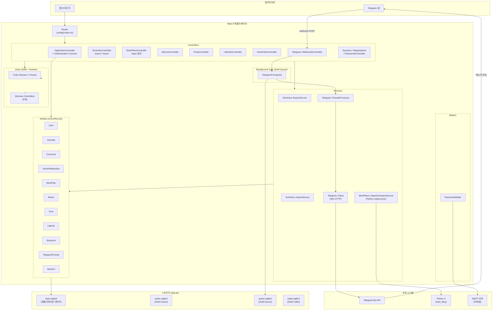
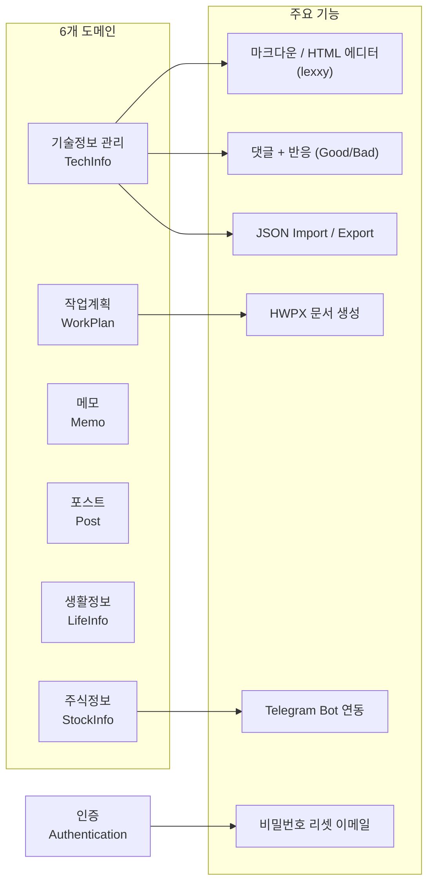
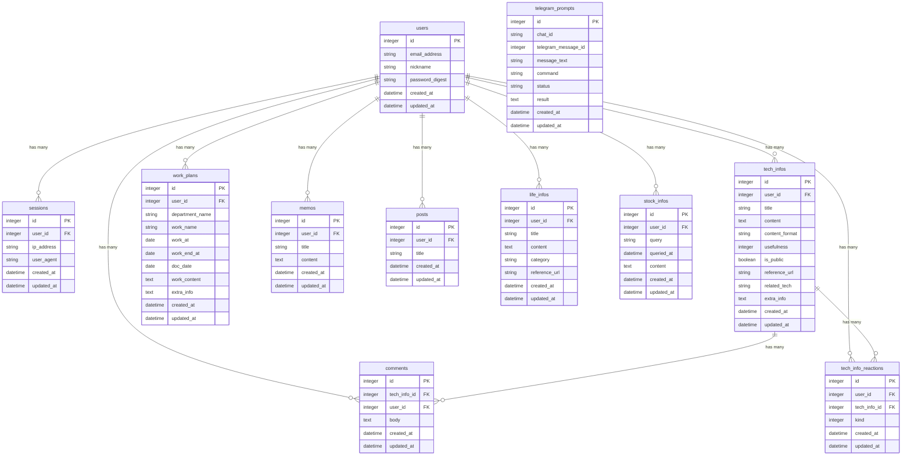
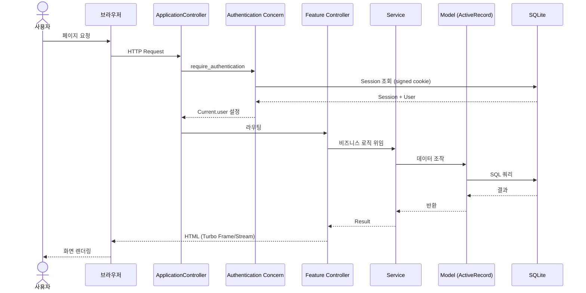
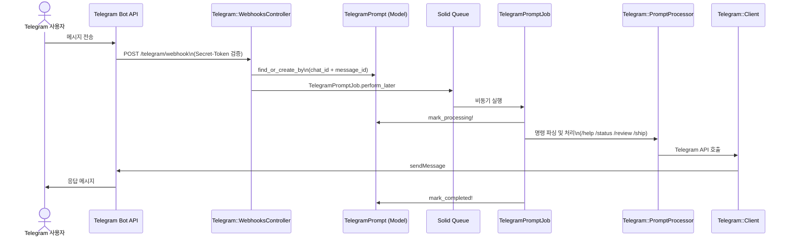
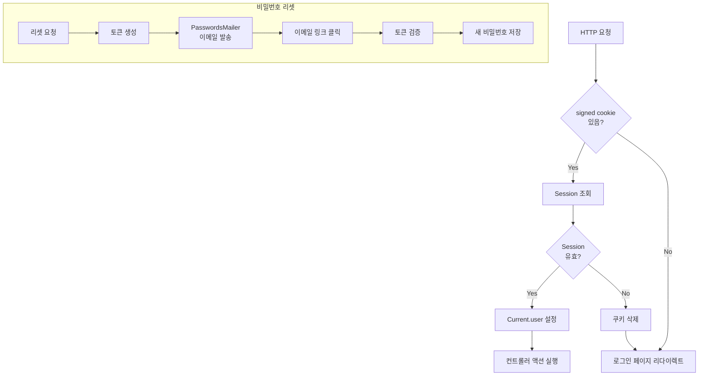

# MyTechInfo

개인 기술정보 관리 시스템. Ruby on Rails 8 기반의 Solid Stack 애플리케이션.

---

## Tech Stack

| 구분 | 기술 |
|------|------|
| Framework | Ruby on Rails 8.1.3 |
| Language | Ruby 3.3 |
| Database | SQLite3 |
| Background Jobs | Solid Queue |
| Caching | Solid Cache |
| WebSocket | Solid Cable |
| Frontend | Hotwire (Turbo + Stimulus), Tailwind CSS 4 |
| Asset Pipeline | Propshaft + Import Maps |
| Authentication | Rails 8 Built-in (has_secure_password) |
| Deployment | Kamal 2 + Thruster |

---

## 시스템 아키텍처



---

## 도메인 구조



---

## 데이터베이스 ERD



---

## 요청 흐름



---

## Telegram Bot 흐름



---

## 인증 흐름



---

## 디렉토리 구조

```
app/
├── controllers/
│   ├── concerns/authentication.rb   # 세션 기반 인증
│   ├── telegram/webhooks_controller.rb
│   └── ...
├── models/
│   ├── current.rb                   # CurrentAttributes
│   ├── telegram_prompt.rb           # 상태 머신 (pending→processing→completed/failed)
│   └── ...
├── services/
│   ├── tech_infos/
│   │   ├── export_service.rb        # JSON export
│   │   └── import_service.rb        # JSON import
│   ├── telegram/
│   │   ├── client.rb                # Telegram Bot API
│   │   └── prompt_processor.rb      # 명령 처리
│   └── work_plans/
│       └── hwpx_generator_service.rb  # Python subprocess → HWPX
├── jobs/
│   └── telegram_prompt_job.rb       # Solid Queue
├── javascript/controllers/          # Stimulus (8개)
│   ├── content_editor_controller.js # lexxy 에디터
│   ├── nav_search_controller.js     # Cmd+K 검색
│   └── ...
└── views/                           # ERB + Turbo
```

---

## 개발 명령어

```bash
# 서버 실행
bin/dev

# 테스트
bundle exec rspec

# 린트
bundle exec rubocop -a

# 마이그레이션
bin/rails db:migrate

# 보안 검사
bin/brakeman --no-pager

# 콘솔
bin/rails console
```

---

## 배포

[Kamal 2](https://kamal-deploy.org/) + [Thruster](https://github.com/basecamp/thruster) 사용.

```bash
kamal deploy
```
